  <!-- THEME-AWARE DYNAMIC HERO BANNER -->
  <picture>
    <source media="(prefers-color-scheme: dark)" srcset="./dark.svg">
    <source media="(prefers-color-scheme: light)" srcset="./light.svg">
    
  </picture>

    

  <!-- QUICK CONNECT BADGES -->
  
  
  
  

---

### 👨‍💻 About Me

I am a results-driven **Frontend Developer** with **2+ years of production experience** engineering responsive, scalable, and high-performance web applications using **Next.js 15, React 19, and TypeScript**.

- 🔭 **Current Focus:** High-performance web architecture, SSR/SSG rendering patterns, Core Web Vitals optimization, and modular UI engineering.
- 🎨 **Engineering Philosophy:** Clean component modularity, pixel-perfect Figma design translation, and accessible user experiences.
- 📍 **Location:** Hyderabad, India · *Open to Full-Time Remote and Hybrid Opportunities.*

---

### 🛠️ Technical Stack & Tooling

<table>
  <tr>
    <td align="center" width="160"><strong>Languages</strong></td>
    <td>
      
      
      
      
    </td>
  </tr>
  <tr>
    <td align="center" width="160"><strong>Frameworks &amp; UI</strong></td>
    <td>
      
      
      
      
    </td>
  </tr>
  <tr>
    <td align="center" width="160"><strong>Architecture &amp; APIs</strong></td>
    <td>
      
      
      
      
    </td>
  </tr>
  <tr>
    <td align="center" width="160"><strong>DevOps &amp; Platforms</strong></td>
    <td>
      
      
      
      
      
      
    </td>
  </tr>
</table>

---

### 📬 Connect With Me

  
  &nbsp;
  
  &nbsp;
  

 

  Designed &amp; engineered with passion by <strong>Bongu Sri Lakshmi</strong> · 2026

